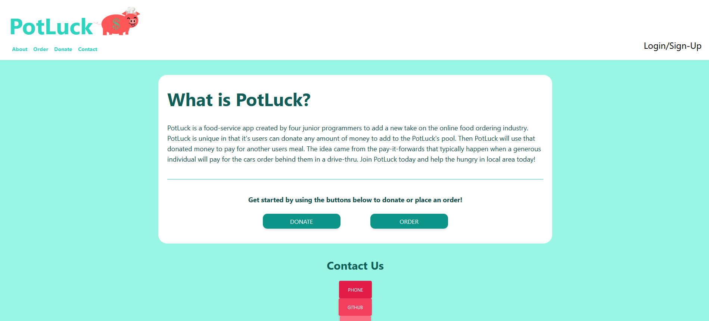

# [PotLuck](https://potluck-inc.herokuapp.com/)

## Description
[PotLuck](https://potluck-inc.herokuapp.com/) is an online ordering app that takes community to the next level. In our application the user will be able to create an account, find a restaurant near them, and order food from said restaurant. However, they will also be able to donate. So, that donated money will be collected into PotLuck’s pool of other donations for that restaurant, and will be used on other peoples orders. So if someone who ordered before you decided to pay-it-forward, then you could get your food for free! People who donate will receive a badge next to their profile for recent donations. And in the future we are looking to add a chat system that will display recent donations as well! However, the user doesn’t have to donate if they do not wish to. Try your Luck with PotLuck today! [Click here to view the website!](https://potluck-inc.herokuapp.com/)

## Table of Contents
- [Installation](#installation)
- [Usage](#usage)
- [Questions](#questions)
- [Tech](#technologies-used)
- [Future](#future-developments)

## Installation
No installation required. However, before users can make donations or place orders, they first must create an account and verify their email address.

## Usage
To donate or order, first create an account by clicking "Login/Sign-Up" at the top right of the website. Be sure to sign up with a valid email address - you'll need to verify your email address before you can donate or order. A verification email will automatically be sent to the provided email address after signing up. Included in the verification email is the verification link where you can enter the verification code (the website automatically loads this screen after signing up as well).

## Questions
Feel free to direct any questions at any of our group members! You can find our contact information on our separate GitHub accounts.

## Technologies Used
* Node.js back-end runtime environment
* TailWind CSS
* Heroku for live deployment
* JawsDB Heroku add-on for MySQL Database functionality
* Stripe for payment
* Handlebars for dynamic webpage template creation
* Express server framework
* Mysql2 database management system 
* Sequelize module 
* Nodemailer for automatic email functionality
* Canva to make the pig logo

## Future Developments
* API search for local restaurants
* Chat system
* Expanded badge system
* Suggest a Restaurant form
* Donation use cap/limit per day