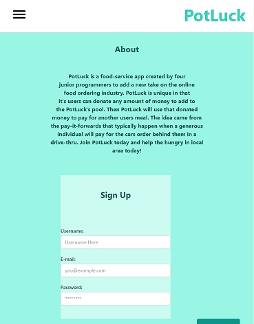

# shiny-octo-tribble

[PotLuck](https://potluck-inc.herokuapp.com/)

PotLuck is an online ordering app that takes community to the next level. In our application the user will be able to create an account, find a restaurant near them, and order food from said restaurant. However, they will also be able to donate. So, that donated money will be collected into PotLuck’s pool of other donations for that restaurant, and will be used on other peoples orders. So if someone who ordered before you decided to pay-it-forward, then you could get your food for free! People who donate will receive a badge next to their profile for recent donations. And in the future we are looking to add a chat system that will display recent donations as well! However, the user doesn’t have to donate if they do not wish to. Try your Luck with PotLuck today!

User Story:
As someone who wants to eat:
I want to be able to order food
And have the the local funds available to me to subtract my total
So I will not go hungry because I am lacking in money.

Technologies used: TailWind, Heroku, Stripe, Node.js, Handlebars, Express, Mysql2, Sequelize, and Canva to make the pig logo.

FUTURE DEVELOPMENTS
API search for local restaurants
Chat system
Expanded badge system
View as guest
Suggest a Restaurant form
Donation use cap/limit per day